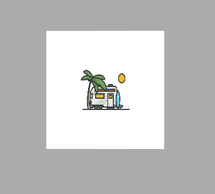

# FlipView
Swift UIView subclass that flips like a double-sided coin between two views.

## Usage
>Add `FlipView.swift` into your project

>Creat the FlipView

`let flipView = FlipView()`

`self.view.addSubview(flipView)`

`flipView.frame = CGRect(x: 125, y: 100, width: 100, height: 100)`

>Set the primaryView and SecondaryView
 
`flipView.primaryView.image = UIImage(named: "surfingCamp")`

`flipView.secondaryView.image = UIImage(named: "pokemon2")`

>Start to flip

`startFlip()`

##Jianshu
[FlipView With AutoLayout](http://www.jianshu.com/p/7bbee9015463)